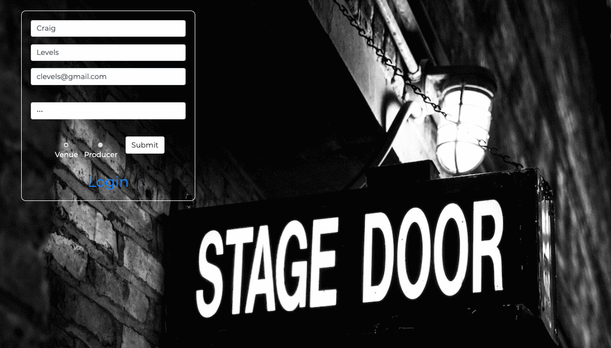
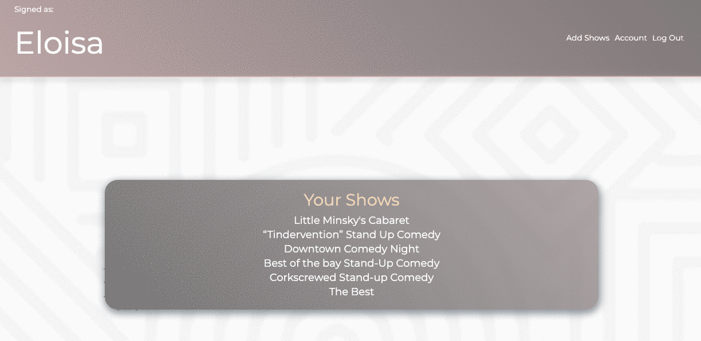

# BRAVO

## Summary

**Bravo** is a web-based platform focused on keeping small shows and independent live performance alive in the Bay Area by helping inexperienced producers find the right venue, and vice versa. This is a hard problem because there are many characteristics to venues, and different sets of characteristics are needed to create successful shows for different acts. 

Users can sign up as either a producer of a show or a proprietor of a venue. They are then asked a series of questions about their act or their space. Bravo then uses a heuristic-based algorithm to list the best matching venues and acts that would create the most successful show.

## About the Developer

Bravo was created by Eloisa Furnaguera, a Software Engineer, Stand-up comedian and producer of shows all around the Bay Area. Here, in her first project, she has combined years of show business experience with her technical knowledge to help with a problem she has seen one too many times in the real world. To find out more about her, visit her [LinkedIn](https://www.linkedin.com/in/eloisa-furnaguera/).

## Technologies

*Frontend*: React, Javascript, CSS Flexbox, HTML, Bootstrap

*Backend*: Python, Flask, PostgreSQL, SQLAlchemy
           (A previous implementation used jQuery paired with Jinja)


## Features

Users can sign up as either a producer of a show or a proprietor of a venue. They then fill out a form with all of the critical information needed for Bravo’s matching algorithm. Below, we show a producer signing up.




Once the venue is registered, you can see the acts that would create the best shows for that venue’s characteristics.


On the flip side, producers log in to their homepage where they can view a listing of all the shows that they’ve entered into the system.


Producers add a new show by filling out a form that provides information about their act needed to create good matches to venues.




On a particular show’s profile page, there is a button to click that will quickly show all the available venue matches for that show.


## Requirements:

- PostgreSQL
- Python 3

To have this app running on your local computer, please follow the below steps:

Clone repository:
```
$ git clone https://github.com/EloisaFurnaguera/Bravo
```
Create a virtual environment:
```
$ virtualenv env
```
Activate the virtual environment:
```
$ source env/bin/activate
```
Install dependencies:
```
$ pip3 install -r requirements.txt
```
Create database 'bravo'.
```
$ createdb bravo
```
Create your database tables and seed example data.
```
$ python3 model.py
```
Run the app from the command line.
```
$ python3 server.py
```
If you want to use SQLAlchemy to query the database, run in interactive mode
```
$ python3 -i model.py
